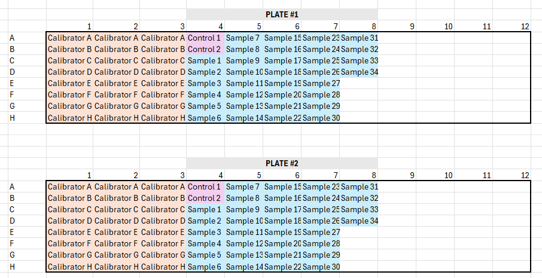
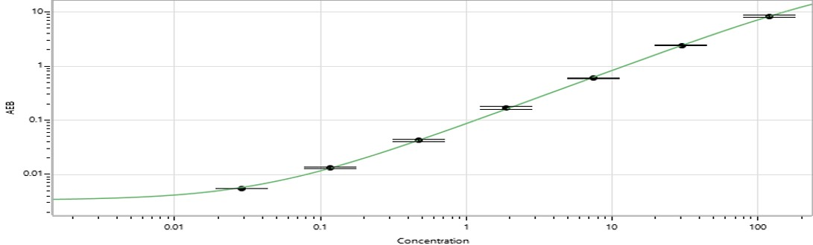
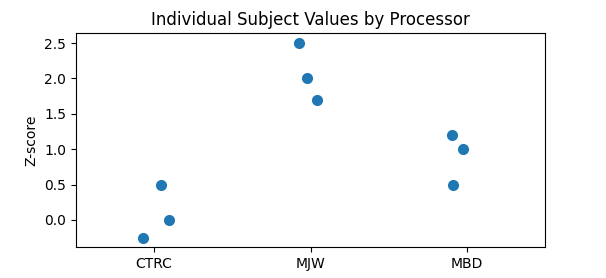

# Batch Randomization for Biological Samples in Longitudinal Data Analysis
Wingerson, MJ  
mat.wingerson@gmail.com

## Description
This project provides a structured method and tool for randomizing participant biological samples across plates or batches while numerically evaluating the balance of key participant covariates post-randomization. The goal is to mitigate batch effects commonly encountered in the analysis of biological samples.

**This project, developed with support from Patrick Carry and Carson Keeter, builds upon their existing [randomization scheme](https://github.com/carryp/PS-Batch-Effect) by including a longitudinal component.**

---

# :microscope:Overview

The collection of **biological samples**, such as blood plasma or serum, provides an objective means of measuring physiological responses to injury and rehabilitation. However, **sample processing, long-term storage, and analysis** introduce multiple opportunities for bias (see [Troubleshooting](#troubleshooting) below for potential issues). One common issue, which can be mitigated with moderate pre-planning, is **batch effects**.

### What are batch effects?
Batch effects occur when samples processed in different batches produce systematically different results. Each batch analyzed using the Single Molecule Array (SIMOA) is subject to a certain degree of error or variability. In theory, the same sample could be analyzed in multiple batches and return slightly different values each time.

To minimize batch effects, three approaches are commonly used:
1. Plate calibrators help reduce measurement error for each plate.
2. Internal controls, either pooled or unpooled, are included on every plate to quantify differences between plates.
3. **Batch randomization** ensures that samples are assigned to different batches in a way that reduces the risk of disproportionate distribution of relevant participant characteristics (e.g., demographics, injury characteristics).

---

## Batch Randomization

A simple randomization scheme can be used to assign samples to different batches. *In theory*, simple randomization is effective when the number of batches and batch sizes are large. However, this rarely reflects real-world research on biological samples, where batch sizes are limited and the number of batches is small.

For example, a 5-year longitudinal study in our lab may process 8–12 batches, with each batch containing 34 samples. In such cases, simple randomization may not be sufficient to ensure that batches remain balanced across relevant covariates.

---

## Randomization and Propensity Score Checking

To address the issue of imbalanced randomization, we implement a two-step approach: 
1. Randomly assign samples to batches using simple randomization.
2. Evaluate the success of the randomization using propensity scores.

### What are propensity scores?
A **propensity score** represents the probability that a sample belongs to a particular batch, given known sample characteristics (e.g., age, biological sex). 
- High propensity scores indicate that batch assignment is not truly random, and that batch membership can be predicted using these characteristics.
- Low propensity scores suggest that the sample characteristics are well-balanced across batches, making batch assignment less predictable.

By iterating this process multiple times, we generate several potential randomization schemes, each with an associated propensity score. Researchers can then select a randomization scheme that optimally balances covariates across batches.

---

## Longitudinal Data as a Unique Challenge

Longitudinal studies — where samples are collected from the same participant across multiple time points — present an additional challenge: ideally, all samples from a single participant should be processed in the same batch to minimize within-subject variability.

### Key considerations:
- Samples from the same participant must remain within the same batch.
- The number of samples per participant (which may vary due to compliance or attrition) must be accounted for.
- The maximum batch size must not be exceeded.

---

## Example Plate Layout

Included below is an example plate layout containing calibrators, internal plate controls, and participant samples. This example plate layout is available to [download](https://github.com/wingersonMJ/batch_randomization/blob/main/SIMOA_plate_layout_examples.xlsx).



---

## Summary

Batch effects introduce bias when analyzing biological samples, but randomization strategies can help mitigate these issues. A two-step approach of randomizing samples to batches and then evaluating balance using propensity scores can improve the stability of batch assignments. Longitudinal study designs require additional considerations.

---

# :hammer_and_wrench:How It Works  

Two functions are defined in the included source code: `randomAssignment` and `propensity_scores`.

---

## `randomAssignment`  

### Purpose:
Randomize participants to batches, given a batch size constraint, number of batches, and desired iterations.

### Expected Inputs:
- `data`: your dataset, expecting wide format and a column defining the subject identifier and a column defining the number of samples for that subject.  
- `subjectID`: the column for the subject identifier.
- `nVisits`: the column for the number of samples (or visits) for the subject.
- `seed`: set seed for repeatability.
- `nIter`: number of iterations to run.
- `batchSize`: maximum size for each batch.
- `nBatches`: number of batches desired.

### Key Operations:
For each iteration, generate a list of the subject identifier and the number of visits for that subject. Then, randomly shuffle that list:
```python
for _ in range(nIter): 
    subjects = data[[subjectID, nVisits]].itertuples(index=False, name=None)
    subjects = list(subjects) 
    random.shuffle(subjects)
```

For each subject and their number of visits, and for each batch, add subjects iteratively if thier nVisits does not violate the total batch size constraint:
```python
for subj, visits in subjects:
            for i in range(nBatches):
                if batch_totals[i] + visits <= batchSize:
                    batches[i][subj] = visits
                    batch_totals[i] += visits
                    break
```

---

## `propensity_scores`

### Propensity scores defined:
A propensity score is a conditional probability of belonging to a batch given a set of covariates. In other words, it is the probability of a subject belonging to a certain group based on known characteristics about that subject. For example, if boys are more likely to be in batch #1, and girls in batch #2, then a boy subject would have a high conditional probability of belonging to batch #1 given sex.

*Formula:*  
$e(X)=Pr(Z=j∣X)$  

$e(X)$ = propensity score given covariates $X$  
$Pr(Z=j∣X)$ = probability of belonging to a batch $j$ given covariates $X$  

In the context of this project, identifying batch randomizations with low overall propensity scores means that pre-determined subject characteristics are well-distributed across batches.  

### Expected inputs:  
- `data` = your dataset  
- `subject_id` = the column in your dataset that defines your subject identifier  
- `covariates` = a list of the covariates used for balancing  
- `randomized_assignments` = the output from the randomizedAssignment function above  

### Key operations:  
For each batch, create a binary variable to represent if the subject is in the batch or not:
```python
for batch in iteration:
    temp_data = data.copy()
    temp_data['batch'] = temp_data[subject_id].isin(batch).astype(int)
```

Use a logistic regression to predict the probability of belonging to a batch given covariates:
```python
model = LogisticRegression()
            model.fit(temp_data[covariates], temp_data['batch'])
            temp_data['propensity_score'] = model.predict_proba(temp_data[covariates])[:, 1]
```

Calculate the propensity score as the difference in the true value and the predicted probability for both in-batch and out-batch subjects:
```python
in_batch = temp_data.loc[temp_data['batch'] == 1, 'propensity_score']
out_batch = temp_data.loc[temp_data['batch'] == 0, 'propensity_score']

diff = abs(in_batch.mean() - out_batch.mean())
batch_diffs.append(diff)
          
avg_balance = np.mean(batch_diffs)
```

This returns a balancing metric (`batch_diffs`), which represents the propensity for in- vs out-batch membership given covariates. If covariates are properly balanced between batches, then the probability of being in-batch will be relatively equal to the probability of being out-batch. Therefore, the difference between these two scores will be very small (i.e., balanced).  

These balance scores are then averaged across all subjects and all batches.  

The function returns your original dataset, with an added column 'Batch_Assignment' for the randomized batch assignment for each subject based on which randomized iteration returned the lowest propensity score (i.e., most balanced):
```python
data['Batch_Assignment'] = None
    for batch_num, group in enumerate(best_batches, start=1):
        data.loc[data[subject_id].isin(group), 'Batch_Assignment'] = batch_num

 return data, metrics_df
 ```

---

# Use example

```python
# Data 
file_path = 'your_path'
df = pd.read_excel(file_path)
```

Run the random assignment function. In this example, `subjectID` and `nVisits` are defined as 'id' and 'nVisits' in my dataset. The `batchSize` constraint is set to 34 samples per batch, and I desire 4 batches total:
```python
assignments = randomAssignment(
                    data = df, 
                    subjectID = 'id', 
                    nVisits = 'nVisits', 
                    seed = 1989,
                    nIter = 50000,
                    batchSize = 34, 
                    nBatches = 4)
```

Define factors for balancing:
```python
covariates = ['site', 'blinded_random_assignment', 'doi_to_v1', 'fivep_sex']
```  

Run the propensity_scores function:
```python
data, metrics = propensity_scores(
                        data = df, 
                        subject_id = 'id',
                        covariates = covariates, 
                        randomized_assignments = assignments)
```

## Summary statistics:
A simple comparison of covariates across batches can be performed. This will return p-values for comparisons across covariates:
```python
summary = TableOne(
    data, 
    columns= ['site', 'blinded_random_assignment', 'doi_to_v1', 'fivep_sex', 'nVisits'],
    categorical= ['site', 'blinded_random_assignment', 'fivep_sex'],
    continuous= ['doi_to_v1', 'nVisits'], 
    groupby='Batch_Assignment',
    pval=True,
    decimals=2)
print(summary.tabulate(tablefmt = "fancy_grid"))
```

*Note:* Batch_Assignment will return nBatches+1. If you specify 4 batches, you will get 5 batches, with batch #5 representing any left-over samples not assigned to other batches. There is no batchSize constraint on the left-over group. This approach is useful when total samples > `batchSize`*`nBatches` 

---

# Troubleshooting 

## Checking for outliers
1. Visually using a histogram `plt.hist(x)`  
2. Through z-score conversion; $z>3.0$ could be concerning  
$z = \frac{x - \mu}{\sigma}$  
 
*Interpretation of z-scores:* Subject data normalized to represent the number of standard deviations they are from the mean, where a value of 0 indicates 'exactly at the mean'  

## Checking cumulative calibration graph
The calibration graph plots the known value for the calibrators on the x-axis and the value estimated by SIMOA on the y-axis.  
This linear or non-linear relationship is used to 'calibrate', or fit/adjust, the actual participant values to reduce measurement error.



Lower and higher values are usually squashed, or level off, because the SIMOA fails to accurately measure high and low concentrations. If outliers exist, check if their absolute values exist in squashed regions of the calibration graph.


## Checking values for samples run in multiple reps
*Run in multiple reps:* Some samples will be analyzed more than once by the SIMOA. For example, BDNF is run in 2 reps. This means you will have two BDNF concentration values for each sample. You use the mean of those values in the analysis, but a SD can also be calculated for that individual sample.  
| Subject ID   | Concentration Rep #1  | Concentration Rep #2  | Mean Concentration | Standard Deviation |
| ------------ | --------------------- | --------------------- | ------------------ | ------------------ |
| 001          | 0.85                  | 0.81                  | 0.83               | 0.03               |
| 002          | 2.20                  | 8.90                  | 5.55               | 4.74               |

If the individual sample SD is large, then the concentrations obtained for that sample across reps were discrepant. This could explain why it is an outlier.  


## Checking sample processor
Track the team member who processed the sample (centrifuged and aliquoted), then check if patterns emerge between team members.  

  

```python
sns.stripplot(x='Processor', y='Z-score', data=data)
```  

## Checking the number of freeze/thaw cycles 
Each freeze/thaw cycle has a risk of damaging the cell membrane. Damaged cell membranes can affect the stability of measurements, particularly because it can  artifically increase the degree of oxidative stress. >3 cycles could be concerning. Check with the team in charge of long-term sample storage for the number of freeze/thaw cycles.  

---

**Other notes for MJ**  
Neuro 4-plex (N4PA; GFAP, Tau, UCH-L1, NF-Light): 34 tests, 6-month shelf life  
Cytokine 4-plex (Cyto 4P; IL1-Beta, IL-6, IL-10, TNF-Alpha): 34 tests, 12-month shelf life  
BDNF: 68 tests across 2 plates, 6-month shelf life  
