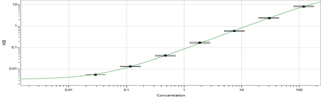

# Plate Randomization for Longitudinal Data/Samples
Wingerson, MJ
## Description
This project provides a structured method and tool for randomizing participant biological samples across plates or batches while numerically evaluating the balance of key participant covariates post-randomization. The goal is to mitigate batch effects commonly encountered in the analysis of biological samples.  
 
**This project, developed with support from Patrick Carry and Carson Keeter, builds upon their existing [randomization scheme](https://github.com/carryp/PS-Batch-Effect) by including a longitudinal component.**  

# Overview:

The collection of **biological samples**, such as blood plasma or serum, provides an objective means of measuring physiological responses to injury and rehabilitation. However, **sample processing, long-term storage, and analysis** introduce multiple opportunities for bias (see [Troubleshooting](#troubleshooting) below for potential issues). One common issue, which can be mitigated with moderate pre-planning, is **batch effects**.  

**Batch effects** occur when samples processed in different batches produce systematically different results. Each batch analyzed using the Single Molecule Array (SIMOA) is subject to a certain degree of error or variability. In theory, the same sample could be analyzed in multiple batches and return slightly different values each time. To minimize batch effects, three approaches are commonly used:
1. Plate callibrators help reduce measurment error for each plate.
2. Internal controls, either pooled or unpooled, are included on every plate to quanitfy differences between plates.
3. **Batch randomization** ensures that samples are assigned to different batches in a way that reduces the risk of disproportionate distribution of relevant participant characteristics (e.g., demographics, injury characteristics).

## Batch randomization:

A simple randomization scheme can be used to assign samples to different batches. *In theory*, simple randomization is effective when the number of batches and batch sizes are large. However, this rarely reflects real-world research on biological samples, where batch sizes are limited and the number of batches is small.  
 
For example, a 5-year longitudinal study in our lab may process 8–12 batches, with each batch containing 34 samples. In such cases, simple randomization may not be sufficient to ensure that batches remain balanced across relevant covariates.

## Randomization and propensity score checking:

To address the issue of imbalanced randomization, we implement a two-step approach: 
1. Randomly assign samples to batches using simple randomization.
2. Evaluate the success of the randomization using propensity scores.

A **propensity score** represents the probability that a sample belongs to a particular batch, given known sample characteristics (e.g., age, biological sex). High propensity scores indicate that batch assignment is not truly random, and that batch membership can be predicted using these characteristics. Low propensity scores suggest that the sample characteristics are well-balanced across batches, making batch assignment less predictable.  

By iterating this process multiple times, we generate several potential randomization schemes, each with an associated propensity score. Researchers can then select a randomization scheme that optimally balances covariates across batches.

## Longitudinal data as a unique challenge:

Longitudinal studies — where samples are collected from the same participant across multiple time points — present an additional challenge: ideally, all samples from a single participant should be processed in the same batch to minimize within-subject variability.

This constraint means that simple randomization is not feasible, as it does not account for repeated samples from the same participant. Instead, the randomization scheme must ensure that:
- Samples from the same participant remain within the same batch
- The number of samples per participant (which may vary due to compliance or attrition) is accounted for
- The maximum batch size is not exceeded

## Example plate layout:
Included below is an example plate layout containing calibrators, internal plate controls, and participant samples. This example plate layout is available to download here.  
  

## Summary:
Batch effects introduce bias when analyzing biological samples, but randomization strategies can help mitigate these issues. A two-step approach of randomizing samples to batches and then evaluating balance using propensity scores can improve the stability of batch assignments. Longitudinal study designs require some additional considerations.

# How it works:  
To be completed later...
# Use example:
To be completed later...

# Troubleshooting 

**Checking for outliers**
1. Visually using a histogram `plt.hist(x)`  
2. Through z-score conversion; $z>3.0$ could be concerning  
$z = \frac{x - \mu}{\sigma}$  
$x$ = individual value  
$\mu$ = mean of dataset  
$\sigma$ = standard deviation of dataset  
*Interpretation of z-scores:* Subject data normalized to represent the number of standard deviations they are from the mean, where a value of 0 indicates 'exactly at the mean'
 

**Checking cumulative calibration graph**  
 
The calibration graph plots the known value for the calibrators on the x-axis and the value estimated by SIMOA on the y-axis.  
This linear or non-linear relationship is used to 'calibrate', or fit/adjust, the actual participant values to reduce measurement error.

Lower and higher values are usually squashed, or level off, because the SIMOA fails to accurately measure high and low concentrations.  
If outliers exist, check if their absolute values exist in squashed regions of the calibration graph.
 
 

**Checking values for samples run in multiple reps**  
 
*Run in multiple reps:* Some samples will be analyzed more than once by the SIMOA. For example, BDNF is run in 2 reps. This means you will have two BDNF concentration values for each sample. You use the mean of those values in the analysis, but a SD can also be calculated for that individual sample.  
| Subject ID   | Concentration Rep #1  | Concentration Rep #2  | Mean Concentration | Standard Deviation |
| ------------ | --------------------- | --------------------- | ------------------ | ------------------ |
| 001          | 0.85                  | 0.81                  | 0.83               | 0.03               |
| 002          | 2.20                  | 8.90                  | 5.55               | 4.74               |

 
If the individual sample SD is large, then the concentrations obtained for that sample across reps were discrepant. This could explain why it is an outlier.  
 
 

**Checking sample processor**  
 
Track the team member who processed the sample (centrifuged and aliquoted), then check if patterns emerge between team members.  
  
`sns.stripplot(x='Processor', y='Z-score', data=data)`  
  

**Checking the number of freeze/thaw cycles**  
 
Each freeze/thaw cycle has a risk of damaging the cell membrane. Damaged cell membranes can affect the stability of measurements, particularly because it can  artifically increase the degree of oxidative stress. >3 cycles could be concerning.  
Check with the team in charge of long-term sample storage for the number of freeze/thaw cycles.  
 
 

---
**Other notes for MJ**  
Neuro 4-plex (N4PA; GFAP, Tau, UCH-L1, NF-Light): 34 tests, 6-month shelf life  
Cytokine 4-plex (Cyto 4P; IL1-Beta, IL-6, IL-10, TNF-Alpha): 34 tests, 12-month shelf life  
BDNF: 68 tests across 2 plates, 6-month shelf life  

<!--

-->
